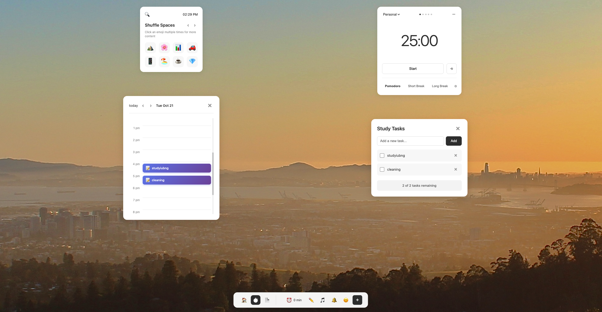

# Focus Study App

A React + TypeScript application for managing focus and study sessions with integrated task scheduling and time tracking.



## Features

### 🍅 Pomodoro Timer
- 25-minute work sessions and 5-minute break intervals
- Start/pause/reset functionality
- Visual progress indicators
- Audio notifications on completion

### ✅ Task Management
- Create and manage study tasks
- Mark tasks as complete
- Delete tasks
- Task counter showing remaining items

### 📅 Day Calendar
- Hourly view from 6 AM to 11 PM
- Tasks automatically scheduled with creation time
- **Drag-and-drop** task rescheduling between time slots
- Visual task blocks with task names

### ⏰ Session Tracking
- Real-time tracking of total study time
- Session counter displays cumulative minutes spent with timer active
- Visible in bottom toolbar

### 🎨 Customizable Backgrounds
- Multiple calming background images
- Easy background switching
- Beautiful photo backgrounds (beach, mountain, cafe, etc.)

## Getting Started

### Installation

```bash
npm install
```

### Development

```bash
npm run dev
```

The app will be available at `http://localhost:5173/`

### Build

```bash
npm run build
```

### Preview Production Build

```bash
npm run preview
```

## Technology Stack

- **React 18** - UI framework
- **TypeScript** - Type safety
- **Vite** - Build tool and dev server
- **CSS3** - Styling with animations

## Project Structure

```
src/
├── App.tsx                    # Main application component
├── App.css                    # Main application styles
├── main.tsx                   # Application entry point
├── index.css                  # Global styles
└── components/
    ├── PomodoroTimer.tsx      # 25/5 minute work/break timer
    ├── TodoList.tsx           # Task management component
    ├── DayCalendar.tsx        # Hourly calendar with drag-and-drop
    ├── BottomToolbar.tsx      # Navigation and session tracker
    └── ShuffleSpaces.tsx      # Background image selector
```

## Usage

1. **Start a Focus Session**: Click "Start" on the Pomodoro timer to begin a 25-minute work session
2. **Add Tasks**: Click the pencil icon (✏️) to open the todo list and add study tasks
3. **View Schedule**: Click the paper icon (📄) to open the day calendar
4. **Reschedule Tasks**: Drag and drop tasks between different time slots on the calendar
5. **Track Progress**: Monitor your total session time in the bottom toolbar (⏰)
6. **Change Background**: Use the shuffle button to switch between different calming backgrounds

## License

MIT
